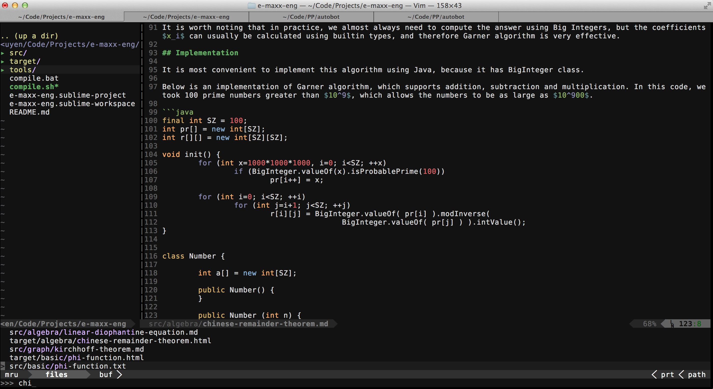

# Vim

Vim là một text editor thô sơ, nhưng có thể dễ dàng thêm plugin, settings để trở thành một text editor rất mạnh.



## Vim cơ bản

Vim gồm 3 mode chính:

* Normal mode: ở mode này, bạn CHỈ có thể dùng lệnh để điều khiển (một vài lệnh cơ bản: di chuyển, cut, copy, undo, thay đổi settings...)
* Insert mode: ở mode này, bạn có thể thay đổi file
* Visual mode: mode này dùng để bôi đen

Chuyển mode:
* Insert / visual mode --> normal: Esc
* Normal mode --> insert: i
* Normal mode --> visual: v

## Normal mode
* Di chuyển:
    - Dùng cách phím mũi tên
    - __w, b__: di chuyển tiến / lùi 1 từ
    - __$__ di chuyển về cuối dòng
    - __^__ về đầu dòng
    - __gg__: di chuyển về đầu file
    - __G__: di chuyển về cuối file
* Search: __/pattern__
* Save: __:w__
* Save & Quit: __:wq__
* Quit & Do not save: __:q!__

Để học thêm: cài vimtutor

## Settings

Ở normal mode, có thể chỉnh settings của vim, ví dụ, gõ __:set nu__ sẽ hiển thị được số dòng.
Vim mạnh ở chỗ tất cả các settings có thể được lưu ở file __~/.vimrc__
File này cũng là chỗ để lưu các plugins settings và các functions mà bạn tự viết để customize Vim. Trong file ~/.vimrc, bạn được dùng ngôn ngữ lập trình Vimscript, nên những gì bạn có thể làm trong ~/.vimrc là vô tận. Các phần sau sẽ nói về 1 số thủ thuật quan trọng của vim.

[File vimrc của RR](https://github.com/ngthanhtrung23/dot_files/blob/master/vimrc)

Bạn có thể tìm được rất nhiều settings quan trọng trong file .vimrc của mình, ví dụ như tab size, hiện số dòng, highlight kết quả search, và tìm ngay khi vừa bắt đầu gõ search, lưu những gì được copy trong vim vào clipboard (để có thể paste vào cac chương trình khác)...

Trong settings, bạn có thể map một số phím tắt thành lệnh / phím tắt khác. [Hướng dẫn](http://vim.wikia.com/wiki/Mapping_keys_in_Vim_-_Tutorial_(Part_1))

## Vim plugins

Plugin đầu tiên mà bạn cần cài là [Vundle](https://github.com/gmarik/Vundle.vim). Plugin này sẽ giúp việc cài các plugin khác đơn giản hơn rất nhiều. Có thể thấy rõ điều này khi nhìn vào file vimrc của mình: Chỉ cần thêm 1 dòng Bundle.... vào vimrc, rồi run command: __:PluginInstall__.

Các plugin mình recommend:
* [Powerline](https://github.com/Lokaltog/powerline): Hiện một số thông tin quan trọng: mode hiện tại, git branch, path/to/file... (xem dòng màu xanh da trời nổi bật ở screenshot)
* [syntastic](https://github.com/scrooloose/syntastic): Syntax checking cho rất nhiều ngôn ngữ lập trình
* [nerdtree](https://github.com/scrooloose/nerdtree): Giúp browse file (phần bên trái của screenshot)
* [jellybeans](https://github.com/nanotech/jellybeans.vim): theme jellybeans rất đẹp
* [ctrlp](https://github.com/kien/ctrlp.vim): giúp browse file trong project bằng Ctrl + P giống như Sublime text

## Tab completion
Thêm đoạn code này vào vimrc --> có thể dùng tab để autocomplete dựa theo các từ có trong file (giống Sublime text)
```vim
function! My_Tab_Completion()
    if col('.')>1 && strpart( getline('.'), col('.')-2, 3 ) =~ '^\w'
        return "\<C-P>"
    else
        return "\<Tab>"
endfunction
inoremap <Tab> <C-R>=My_Tab_Completion()<CR>
```

## Setting cho riêng từng ngôn ngữ

Ví dụ, mình muốn với Python, thì F9 được map thành 1 lệnh chạy Python, với C++ thì F9 được map thành lệnh chạy C++.

Mình có 2 hàm riêng:
```vim
function! PYSET()
  nnoremap <buffer> <F9> :exec '!python' shellescape(@%, 1)<cr>
endfunction
function! CPPSET()
  nnoremap <buffer> <F9> :w<cr>:!clang++ % -o %< -std=c++11 -stdlib=libc++ -I ./<cr>:!./%<<cr>
endfunction
```

Rồi mình gọi 1 trong 2 hàm này dựa trên kiểu file (kiểu file được nhận diện bởi Vim):

```vim
autocmd FileType python call PYSET()
autocmd FileType C      call CPPSET()
autocmd FileType cc     call CPPSET()
autocmd FileType cpp    call CPPSET()
```

## Markdown file

Vim cho phép tự định nghĩa syntax và code highlight. Mình dùng Markdown khá nhiều và không tìm được plugin nào để highlight phù hợp với nhu cầu của mình (cho gõ LaTex trong markdown, cho highlight code trong markdown), nên mình đã tự viết [vim plugin cho markdown](https://github.com/ngthanhtrung23/vim-markdown)

