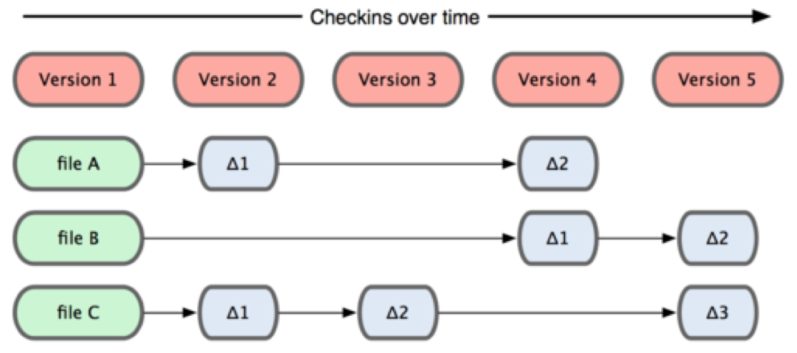

# Cơ bản về Git

## Git thinks of data as snapshot, not difference

Thông thường, các Version control lưu lại dữ liệu bằng cách lưu những thay đổi (difference) lên từng file của Project:

Với git, mỗi version là một _snapshot_ của tất cả các file:

## Hầu hết các thao tác được thực hiện trên máy cá nhân (local)

Như đã nói ở trên, các máy chứa Git project đều có thể có vai trò như nhau. Khi bạn thay đổi một Project và lưu lại (commit), các thay đổi này chỉ có trên máy bạn (local). Chỉ khi bạn đẩy những thay đổi của bạn lên 1 server chung (push), thì những người khác mới có thể thấy thay đổi.

## Các trạng thái của file trong Git

