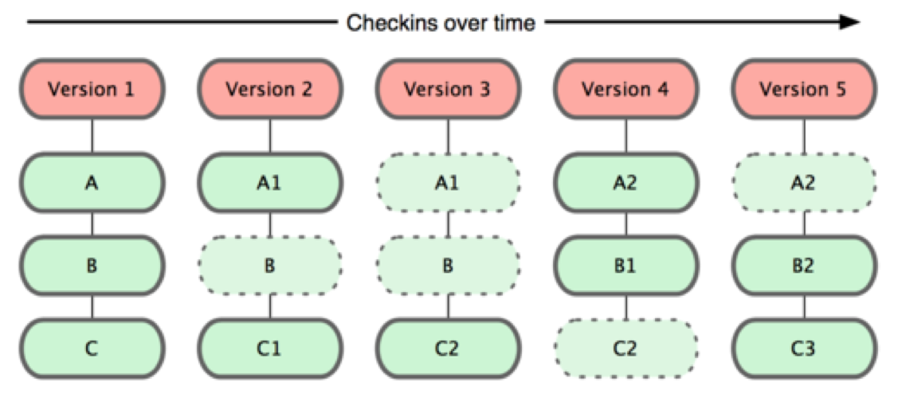
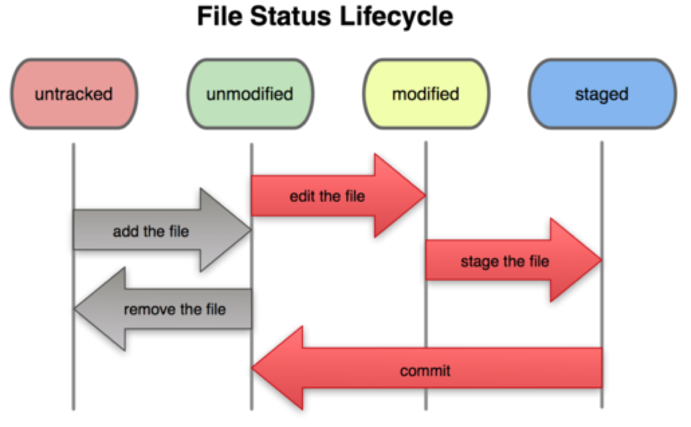

# Cơ bản về Git

## Git thinks of data as snapshot, not difference

Thông thường, các Version control (không phải Git) lưu lại dữ liệu bằng cách lưu những thay đổi (difference) lên từng file của Project:


Với git, mỗi version là một _snapshot_ của tất cả các file:



## Hầu hết các thao tác được thực hiện trên máy cá nhân (local)

Như đã nói ở trên, các máy chứa Git project đều có thể có vai trò như nhau. Khi bạn thay đổi một Project và lưu lại (commit), các thay đổi này chỉ có trên máy bạn (local). Chỉ khi bạn đẩy những thay đổi của bạn lên 1 server chung (push), thì những người khác mới có thể thấy thay đổi.

## Các trạng thái của file trong Git

Một file nằm trong Git Project có thể có 4 trạng thái khác nhau:
* Untracked: Git không biết về sự tồn tại của file đó
* Unmodified: File giống hệt như file ở version gần nhất của Git Project, hoặc vừa được thêm vào project.
* Modified: File bị thay đổi so với version gần nhất của Git Project, hoặc đã bị thay đổi sau khi thêm vào project.
* Staged: File đã được đánh dấu để thêm vào lần commit tiếp theo.

Hình dưới đây mô tả sự chuyển đổi trạng thái của 1 file của git.



Chú ý rằng với định nghĩa trên, thì 1 file trong Git Project, có thể vừa ở trạng thái Staged, vừa ở trạng thái Modified. Đây là một điều rất bình thường với Git. Nếu 1 file vừa ở trạng thái Modified, vừa ở trạng thái Staged, thì khi commit, chỉ những thay đổi được thực hiện trước khi bạn thực hiện lệnh git add được cho vào commit tiếp theo. Và sau khi commit, file vẫn sẽ ở trạng thái Modified.

Để xem trạng thái của các file của Git Project:

```
git status
```

Chú ý rằng những file đang ở trạng thái Unmodified sẽ không hiện ra trong kết quả.

## Bài tập:
* Thử sửa 1 vài file, thêm file, rồi chạy ``git status``
* Thử add & commit các file, rồi chạy ``git status``
* Chú ý đọc tất cả các thứ được in ra (những cái này khá có ích)
* Sau khi nghịch chán, bạn KHÔNG được push lên Github. Cách dễ nhất để project quay về trạng thái ban đầu là clone lại từ đầu.
