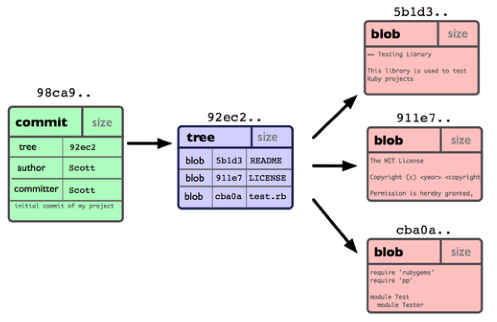
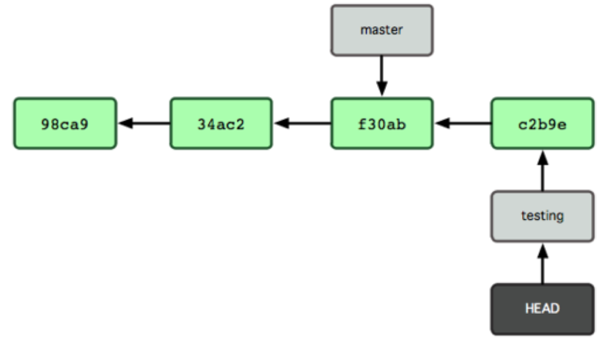
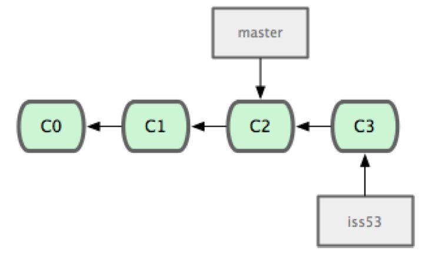
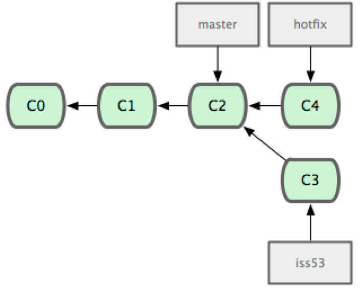
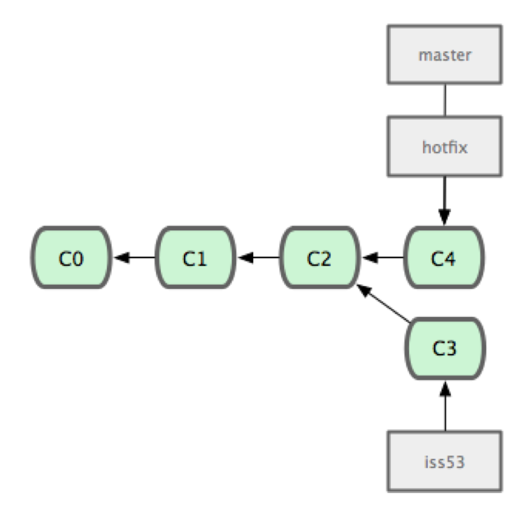
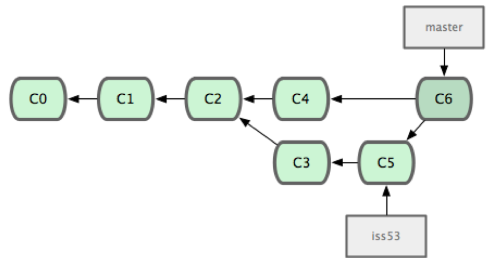

# Commit và Branch

## Định nghĩa

Một commit gồm có:

* Pointer chỉ vào snapshot của một version nào đó
* Thông tin về commit: Author, message
* Pointer chỉ vào các parent commits (sau khi merge, 1 commit có thể có nhiều cha)

Ví dụ về 1 commit:



Một branch là một pointer trỏ vào một commit
HEAD: là pointer trỏ vào commit mới nhất



Trong hình vẽ: có 2 branch, 1 branch master và 1 branch test trỏ vào 2 commit khác nhau. Lúc tạo một Project git, luôn có một branch mặc định là master.

## Ví dụ minh họa

Giả sử bạn đang code một trang web. Bạn có một bản của trang web đang chạy được là branch master. Bạn muốn code thêm một số tính năng mới cho trang web. Cách thông thường được sử dụng là bạn tạo ra một branch mới. Chẳng hạn bạn tạo ra 1 branch tên là iss53:



Khi bạn đang code dở tính năng mới, có người phát hiện ra trang web của bạn có bug nghiêm trọng. Lúc này bạn cần fix bug và cho nó vào branch master (đây cũng là lý do bạn cần phải tạo riêng branch iss53: iss53 có thể cần rất nhiều thời gian mới được code xong, và bạn không thể test bug fix trên một bản không chạy được của trang web). Để fix bug, bạn tạo ra 1 branch mới: hotfix:



Sau khi đã fix bug xong và đảm bảo nó chạy được, bạn có thể merge branch master vào branch bugfix. Lần merge này rất đơn giản do branch master và branch hotfix trỏ vào 2 commit là tổ tiên của nhau. Khi merge 2 commit là tổ tiên của nhau, git chỉ đơn giản là dịch chuyển pointer từ tổ tiên xuống con cháu.



Sau đó, bạn lại quay trở về branch iss53, commit và cuối cùng merge vào branch master. Lần merge này khó hơn do 2 commit tương ứng không phải là tổ tiên của nhau. Để merge 2 commit này, git sẽ tìm tổ tiên chung gần nhất của 2 commit, rồi áp dụng các commit lên tổ tiên gần nhất (được gọi là *3-way-merge*).



[Bài viết đầy đủ](http://git-scm.com/book/en/v2/Git-Branching-Basic-Branching-and-Merging)

## Làm việc với branch:

Tạo branch mới:

```
git checkout -b new_branch_name
```

Xóa branch:

```
git branch -d branch_name
```

Hiển thị tất cả các branch:

```
git branch -v
```

Merge 2 branch: Giả sử đang đứng ở branch master mà muốn merge branch hotfix vào:

```
git merge hotfix
```

Chú ý: để biết branch hiện tại, có thể xem ở trong kết quả của lệnh git status.

