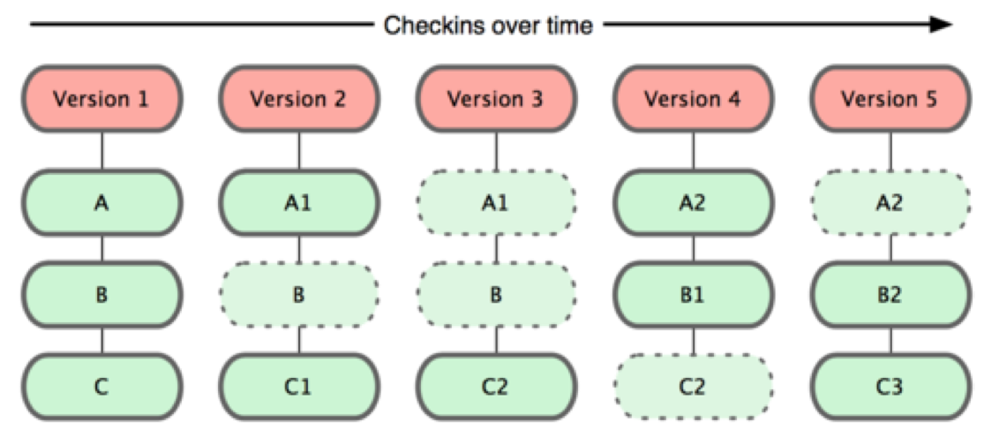
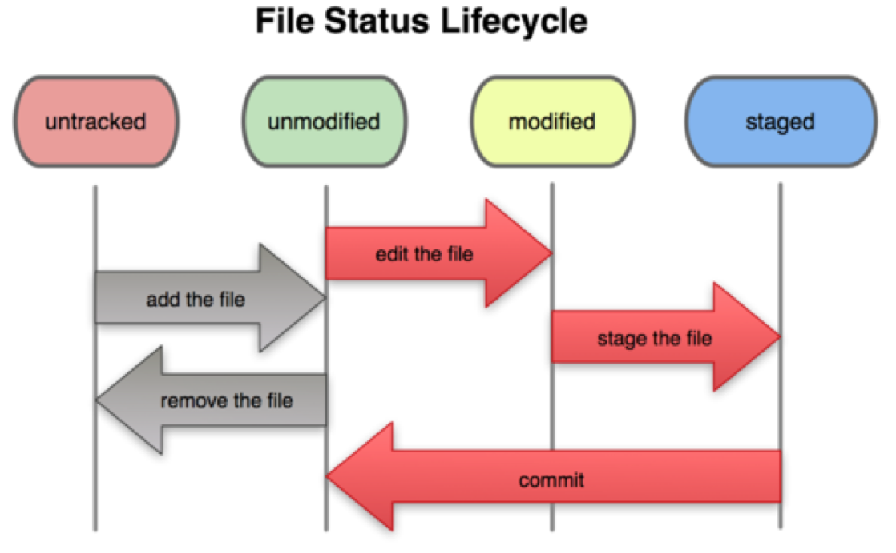

# Version control là gì

Hiện mới copy 1 đoạn chat mình dạy 1 đứa khác dùng git. Nội dung cần phải đc sửa đổi nhiều để phù hợp với việc tự đọc

Version control là một chương trình giúp:

* Lưu lại tất cả các thay đổi với các file, để bạn có thể lấy lại 1 file ở một bản cũ
* Hiệu quả khi làm việc với team

# Git là gì

*Git thinks data as snapshots, not difference*

mỗi 1 cái commit trong Git
là 1 cái snapshots
nó chứa tất cả trạng thái của tất cả các file

mỗi 1 version nó sẽ lưu lại các file bị thay đổi & nó biết các file khác bản cuối bị thay đổi là ở đâu

## Git: Distributed Version Control

nghĩa là ví dụ giờ có chú + anh + github
3 cái đều chứa cái project
thì vai trò của 3 cái là như nhau
đầu tiên giả sử project đc tạo ra ở máy anh nhé
lúc anh push lên github thì cái project nó tồn tại ở trên github
rồi chú pull về thì nó tồn tại trên máy chú
sau đấy anh có thể fetch các thay đổi của project từ máy chú
hoặc từ github
nói chung 3 cái có thể có vai trò tương đương nhau
nhưng để dễ quản lý thì thường làm việc theo mô hình
cái github là máy chủ, mọi người cập nhật thay đổi của mình lên github thường xuyên
và lấy thay đổi của người khác từ github về thường xuyên

# Cấu trúc của 1 Git project

tiếp theo cần biết là trong 1 project, có 1 folder .git
cái folder này chứa những thông tin quan trọng của git
ko đc động vào linh tinh

# Git commit

tiếp theo giờ hình dung chỉ có 1 mình 1 máy
chỉ có 1 cái project trên 1 máy
làm 1 mình
giờ anh sẽ giải thích các trạng thái có thể có của file
commit là gì

đây là sơ đồ các trạng thái của 1 file trong git

1 file khi đc tạo ra
thì nó đc gọi là "untracked", có nghĩa là git ko biết về sự tồn tại của nó
sau đấy chú có thể dùng "git add path/to/file" để cho git biết sự tồn tại của file đấy
lúc này thì file đc gọi là "unmodified"
"unmodified" nghĩa là file giống với trạng thái commit cuối cùng HOẶC LÀ mới đc thêm vào
sau đấy nếu thay đổi file thì file đc cho vào "modified"
cuối cùng còn 1 trạng thái nữa là "staged"
nghĩa là các thay đổi của file sẽ đc thêm vào lần commit tiếp theo
để chuyển file từ "modified" sang "staged" thì "git add path/to/file"
chú ý là git add có 2 tác dụng

1 là chuyển file từ "untracked" sang "unmodified", 2 là chuyển file từ "modified" sang "staged"

thực ra trong cái sơ đồ kia thì hơi khó hiểu ở chỗ nó cho file mới đc tạo ra là "untracked" rồi cho vào "modified"
theo anh lúc git add cái file "untracked" thì nó phải bay sang "staged"
khi file ở trong stage rồi thì lúc git commit nó sẽ rơi vào commit tiếp theo

chỗ này còn 1 chú ý
1 file có thể vừa "modified" vừa "staged"
ví dụ:
thay đổi file lần 1 --> add --> thay đổi file lần 2
thì cái thay đổi file lần 1 đc vào "staged" nhưng cái thay đổi lần 2 vẫn ở trong "modified"
nên lúc trước khi commit
phải luôn git status
xem mình đang commit cái gì
những cái mình sẽ commit nó nằm trong staged
nếu dùng GUI thì thường lúc commit nó phải hiện ngay những cái mình đang commit ở dưới
để tránh commit thiếu
nếu chẳng may commit thiếu
thì có thể git add những cái thiếu
rồi git commit --amend để thay đổi cái commit vừa xong
nhưng cái này sẽ để lại hậu quả CỰC KỲ NGHIÊM TRỌNG nếu đã push cái commit đấy sang máy khác / server
nên nếu đã push thì ko đc dùng git commit --amend

cái amend đấy thực chất là trên máy mình
nó xóa cái commit cũ
và tạo ra 1 cái commit mới
nếu push ra chỗ khác thì nó thành hình chữ V ý
về sau nó sẽ bị ngu

# Git branch

thế để giải thích sơ qua branch là gì
đầu tiên phải hiểu là
các commit nó link đến nhau
nếu có 1 branch thì nó là 1 đường thẳng thôi
có nhiều branch nghĩa là, tại 1 commit nào đấy chú tách nó ra 1 nhánh khác

cái này mục đích là thế này nhé
khi develop soft trên thực tế
thường sẽ có 1 cái bản kiểu chạy đc
để trên master
giờ giả sử muốn develop 1 feature mới
thì ko nên làm tiếp trên master
nếu đang làm feature mới trên branch master
mà lại phát hiện ra bug --> cần fix & commit vào master ngay lập tức
nhưng mà feature đang code dở --> ko thể commit đống đang code dở đc
nên người ta tạo ra 1 branch mới để code cái feature mới trên đấy
