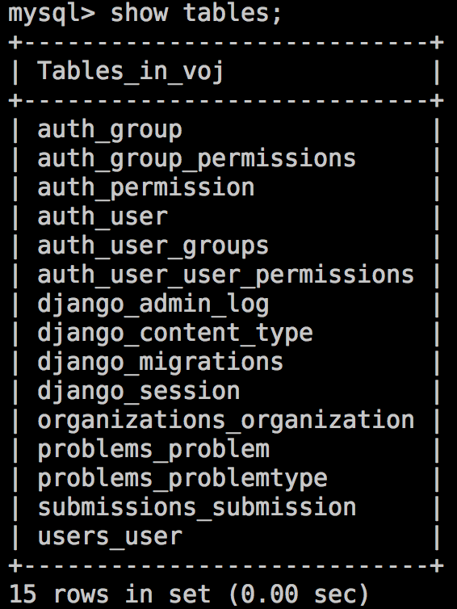
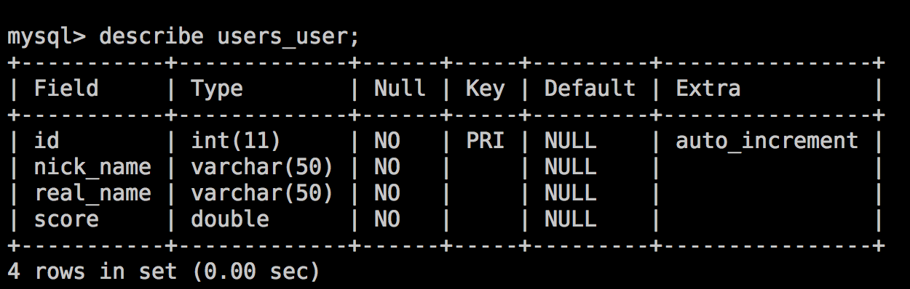
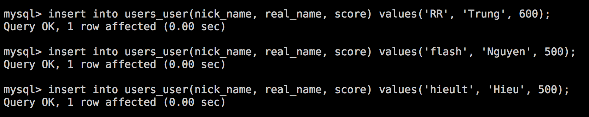
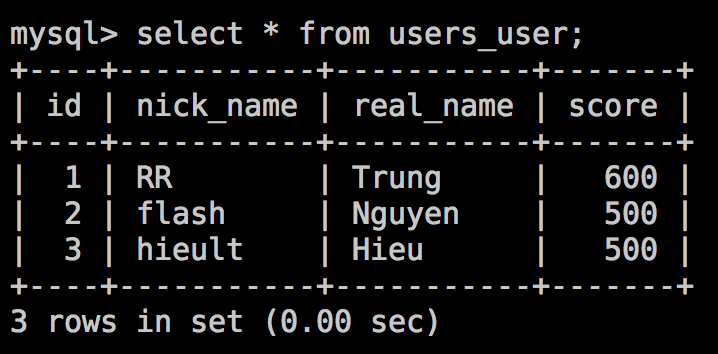

# Database

## Tại sao dùng database

Như ở trên đã nói, dữ liệu của user được lưu trong database. Để hiểu tại sao chúng ta lại cần lưu vào database mà không đơn giản lưu vào file, cần phải hiểu những điểm khác biệt cơ bản giữa database và file:

* Database cho phép insert, delete, update data hiệu quả. Ví dụ giả sử bạn có 1 file dữ liệu chứa thông tin của 1,000,000 người dùng, mỗi người dùng có username, tên, tuổi, password, ngày sinh... Cách đơn giản nhất là lưu tất cả thông tin này vào 1 file 1,000,000 dòng. Nhưng như vậy rất khó update, do bạn không thể thay đổi 1 dòng ở giữa file, dẫn đến mỗi lần thay đổi thông tin user, bạn phải ghi lại tối đa 1,000,000 dòng.
* Database cho phép nhiều người cùng lấy thông tin từ database.
* Dựa vào kinh nghiệm, người ta nhận thấy rằng, đa số các thao tác làm việc với dữ liệu đều chỉ có 1 số loại nhất định. Lấy ví dụ với Facebook:
    - User sửa hình đại diện --> Update thông tin của 1 user
    - User like ảnh --> Insert thêm 1 thông tin mới về like
    - Một user mới đăng ký --> Insert thêm 1 thông tin mới về user
    - User post status --> Insert 1 thông tin mới về post
    Do các thao tác với dữ liệu thường lặp đi lặp lại, người ta đã tạo ra những ngôn ngữ bậc cao hơn (SQL) dùng cho database, để query và update dữ liệu.

## Database trông như thế nào

Các database truyền thống thường được thiết kế theo dạng bảng, với nhiều cột chứa attribute của dữ liệu, mỗi dòng là 1 record, 1 dữ liệu mới.

Ví dụ:

Ở đây mình có 1 database VOJ do mình tự tạo. Database này gồm nhiều bảng. Mình có thể liệt kê các bảng này bằng lệnh SQL:

```sql
show tables;
-- show tables: hiện tất cả các bảng trong database. Chú ý rằng các lệnh trong SQL là case insensitive.
```



Để xem cấu trúc của 1 bảng, ví dụ __users_user__:

```sql
describe users_user;
-- describe <table_name>: hiện thông tin về các cột của bảng.
```



Để thêm dữ liệu vào 1 bảng:

```sql
insert into users_user(nick_name, real_name, score) values ('RR', 'Trung', 600);
-- insert into table_name(col1, col2, ...) values (val1, val2, ...): thêm 1 record vào bảng
```



Hiện các dữ liệu đang có trong bảng:

```sql
select * from users_user;
```



